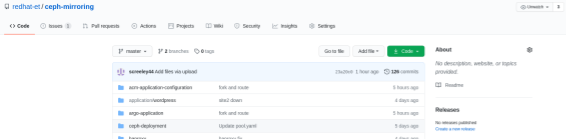
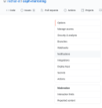
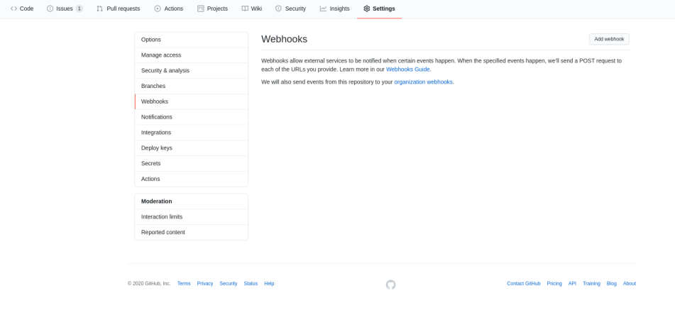
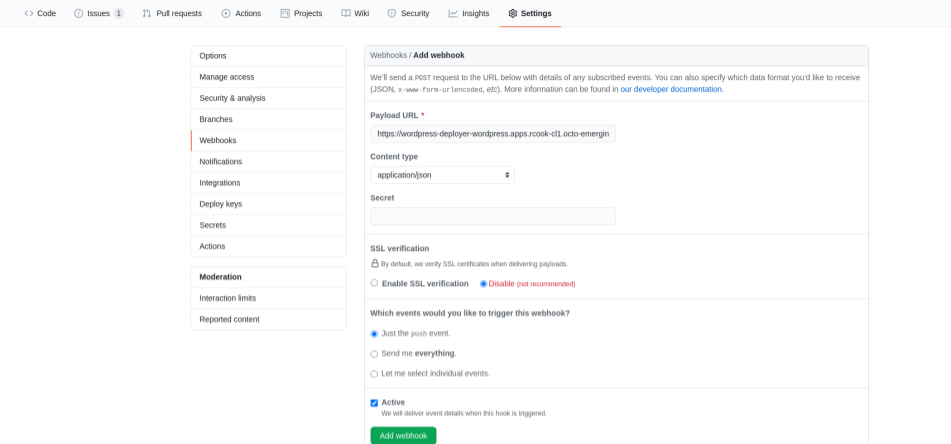
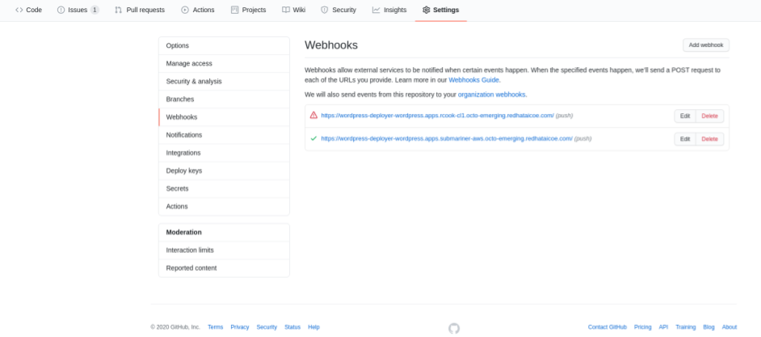

# Tekton
We will assume that Tekton has been installed on each cluster using the operator. We will deploy the pipelines and tasks to both clusters.

NOTE: Before beginning fork this repository and modify the following files as they relate to your repository.

```
pipeline/tekton-pipeline-app-deploy-resource.yaml
webhooks/west1/tekton-webhook.yaml
webhooks/west2/tekton-webhook.yaml
```

## Pipelines and Tasks 
For application deployment the same pipelines and tasks will be used regardless of the cluster.

Export the KUBECONFIG and create the repository.
```
export KUBECONFIG=/home/user/west1/auth/kubeconfig:/home/user/west2/auth/kubeconfig
oc create ns wordpress --context west1
oc create ns wordpress --context west2
oc create -f tasks/ -n wordpress --context west1
oc create -f tasks/ -n wordpress --context west2
oc create -f pipeline/ -n wordpress --context west1
oc create -f pipeline/ -n wordpress --context west2
```

## Additional Permissions
Some additional permissions have been added to allow for the pipeline to update and modify namespaces.
```
oc create -f permissions --context west1 -n wordpress
oc create -f permissions --context west2 -n wordpress
```

## Tekton Webhook
Webhooks are used to trigger our Tekton pipelines when code is pushed to our git repository.

NOTE: Before beginning ensure that you modify *application/wordpress/base/wordpress-route.yaml* to point to your Load balancer and push to your git repository.
 
```
oc create -f webhooks/west1 --context west1 -n wordpress
oc create -f webhooks/west2 --context west2 -n wordpress
```

Record the values of the routes as they will be used in the next section.
```
oc get routes -n wordpress --context west1
oc get routes -n wordpress --context west2
```

Using the route defined within *application/wordpress/base/wordpress-route.yaml* and your web browser follow the procedure to install wordpress.

## Webhook creation in GitHub UI
We now need to tie in the routes created by Tekton into GitHub.

Open your browser and go to your fork of this repository.

Click Settings


Next, Click Webhooks


Add webhook

NOTE: Enter your GitHub password if prompted


Using the value of the routes first create a webhook for west1 and then do the same steps for west2.

NOTE: Ensure you create two routes.



Verify two webhooks have been loaded into GitHub.


## Sync schedule
Follow the instructions for [enabling and scheduling snapshot mirroring](../storage-schedule.md).

# Scaling down west1
We are now ready to begin the process of switching to west2. Modify *application/wordpress/overlays/west1/wordpress-deployment.yaml* and *application/wordpress/overlays/west1/mysql-deployment.yaml* setting the replicas to 0. Push the changes to your git repository.

```
git commit -am 'site1 down'
git push origin master
```

## Sync
The steps required to perform the sync must be uploaded to the two clusters.

```
oc create -f rbd-tekton-resources/latest/tasks/ -n rook-ceph --context west1
oc create -f rbd-tekton-resources/latest/tasks/ -n rook-ceph --context west2
oc create -f rbd-tekton-resources/latest/pipeline -n rook-ceph --context west1
oc create -f rbd-tekton-resources/latest/pipeline -n rook-ceph --context west2
```

We will use a pipeline run to execute the sync.
```
oc create -f pipeline-run/west2.yaml -n rook-ceph --context west2
```

## Switching primary sites
It is now time to define the ArgoCD application which will launch a job to switch the primary and standby sites. A sleep has been added to this step to ensure that the sync from the previous step has completed.
```
sleep 3m
oc create -f tekton/rbd-tekton-resources/latest/pipeline/pipeline-promote.yaml --context west1 -n rook-ceph
oc create -f tekton/rbd-tekton-resources/latest/pipeline/pipeline-promote.yaml --context west2 -n rook-ceph
oc create -f tekton/rbd-tekton-resources/latest/pipeline/pipeline-demote.yaml --context west1 -n rook-ceph
oc create -f tekton/rbd-tekton-resources/latest/pipeline/pipeline-demote.yaml --context west2 -n rook-ceph
oc create -f tekton/rbd-tekton-resources/latest/pipeline/pipelinerun-demote.yaml --context west2 -n rcook-ceph
sleep 30s
oc create -f tekton/rbd-tekton-resources/latest/pipeline/pipelinerun-promote.yaml --context west2 -n rcook-ceph
```

# Bringing up west2
It is now time to bring up west2. Modify *application/wordpress/overlays/west2/wordpress-deployment.yaml* and *application/wordpress/overlays/west2/mysql-deployment.yaml* setting the replicas to 1. Push the changes to your git repository.

```
git commit -am 'site2 up'
git push origin master
```

The webhook will trigger Tekton to automatically deploy the application. Once the application pods have started you can use the route defined in *application/wordpress/base/wordpress-route.yaml* to validate that the application is indeed running on west2.

# Returning to west1
To return to west1 the process is somewhat similar. Modify *application/wordpress/overlays/west2/wordpress-deployment.yaml* and *application/wordpress/overlays/west2/mysql-deployment.yaml* setting the replicas to 0. Push the changes to your git repository

```
git commit -am 'site2 down'
git push origin master
```

## Syncing the storage
We will delete the sync pipelinerun from *west2* and move it to *west1*.

```
oc delete pr/resync-images --context west2 -n rook-ceph
oc create -f pipeline-run/west1.yaml --context west1 -n rook-ceph
```

This will cause the sync job to be launched on west1.


## Switching primary sites
The pipeline is already defined in Tektkon which will trigger the standby to become primary but we need to remove the old pipeline run and then execute it on the other cluster. 

```
oc delete -f tekton/rbd-tekton-resources/latest/pipeline/pipelinerun-promote.yaml --context west2 -n rcook-ceph
oc delete -f tekton/rbd-tekton-resources/latest/pipeline/pipelinerun-demote.yaml --context west1 -n rcook-ceph
oc create -f tekton/rbd-tekton-resources/latest/pipeline/pipelinerun-demote.yaml --context west2 -n rcook-ceph
sleep 30s
oc create -f tekton/rbd-tekton-resources/latest/pipeline/pipelinerun-promote.yaml --context west1 -n rcook-ceph
```

# Bringing up west1
It is now time to bring back west1. Modify *application/wordpress/overlays/west1/wordpress-deployment.yaml* and *application/wordpress/overlays/west1/mysql-deployment.yaml* setting the replicas to 1. Push the changes to your git repository.

```
git commit -am 'site1 up'
git push origin master
```

This will trigger the west1 pods to launch. This will conclude the fail back to west1 and all of our data should be present.
